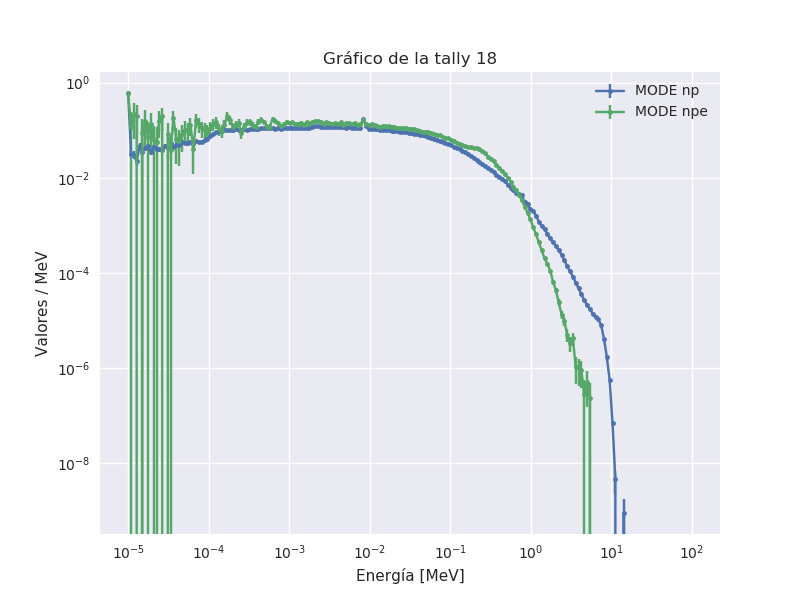

# Pruebas sobre simulación de la energía depositada en Si con MCNP

## Objetivo:

Analizar el error que se comete al calcular la energía depositada utilizando una tally F8 para fotones. No se tiene en cuenta la energía depositada por neutrones.

## Modelo utilizado:

  - Una fuente cuasi puntual de $^{252}$Cf
  - Una cuasi esfera de 3cm de Pb
  - Un cascarón esférico de 5cm de Cu
  - Un cascarón esférico de 650um de Si

Para simular a fuente de californio, se utilizó el método FREYA.

Para calcular la energía depositada se utilizó una tally F8.

## Desarrollo:

Se probó simulando dos réplicas del modelo, donde en un caso se simularon neutrones y fotones (np), mientras que en el segundo se simularon neutrones, fotones y electrones (npe).

Cuando se corrió en modo np se utilzó una tally F8 para fotones.

Cuando se corrió en modo npe se utilizó una tally F8 para electrones.

En esta carpeta están los archivos de entrada y salida utilizados:
   
- `mode_np(e)` : inputs para modos np y npe
- `mode_np(e).o` : outputs para modos np y npe

#### Importante: 

La corrida con electrones incrementa entre uno y dos órdenes de magnitud la duración de la simulación.

## Resultados

