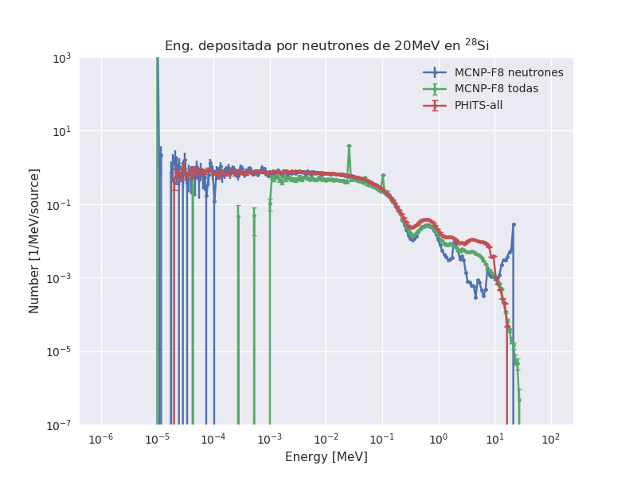

# Pruebas para comparar la forma de calcular energía depositada por neutrones entre PHITS y MCNP

## Modelo:

    - Fuente puntual de neutrones de 20MeV isotrópica
    - Esfera de 30Si de 2 cm de radio

## Notas

    - Revisar todo, a pesar de que dan parecido, pueden estar ambas mal
    - Tanto MCNP y PHITS tienen muchos parámetros para tunear el resultado.

## Resultados

    - Para tomar a primer orden, sin haber investigado mucho todos los parámetros que pueden influir

