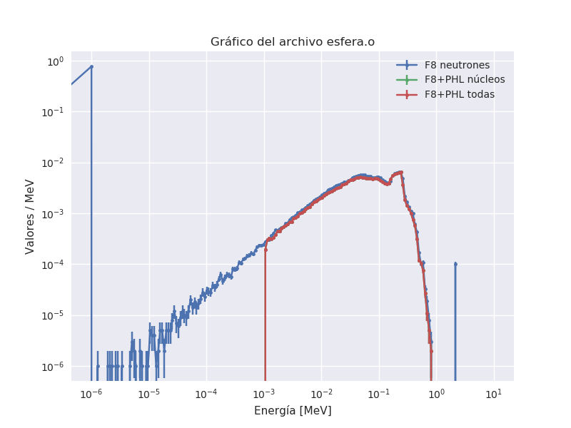

# Energía depositada por neutrones en MCNP

## Modelo:

    - Fuente puntual de neutrones de 20MeV isotrópica
    - Esfera de 30Si de 2 cm de radio

## Notas

    - Los núcleos y partículas livianas tienen un corte de energía mínima en 1keV

    - Llama la atención que la energía depositada por neutrones de bien.

    - Si no se incluyen los electrones en MODE, y se hace tally sobre los fotones, entonces la energía depositada total da distinta respecto a haberlos inlluido y hacer tally sobre electrones.

    - Se debe activar coilf en PHYS:N para que se genere el Light-ion recoil. Parece que no hace diferencia tener el NCIA activo o apagado (ver pg. 128 manual MCNP).

    - Se usa ilaq=1 en LCA ( use LAQGSM03.03 to handle all heavy ion interactions as well as all light ion interactions.)

    - Los archivos `sin_elec_coilf*` son pruebas variando el parámetro coilf. 

## Resultados

