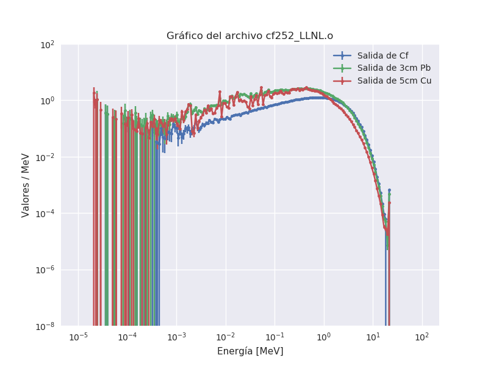
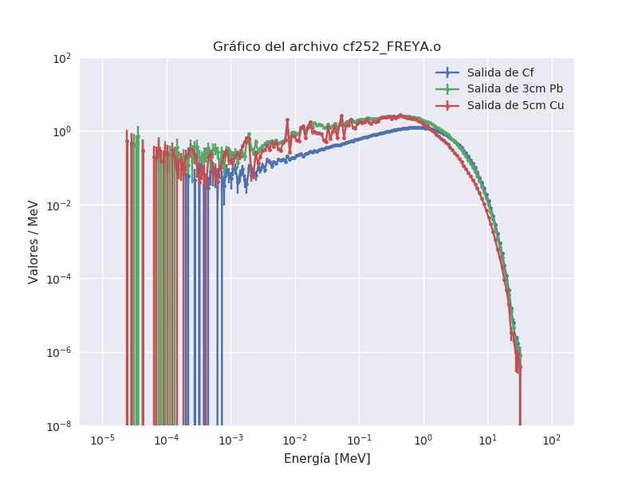
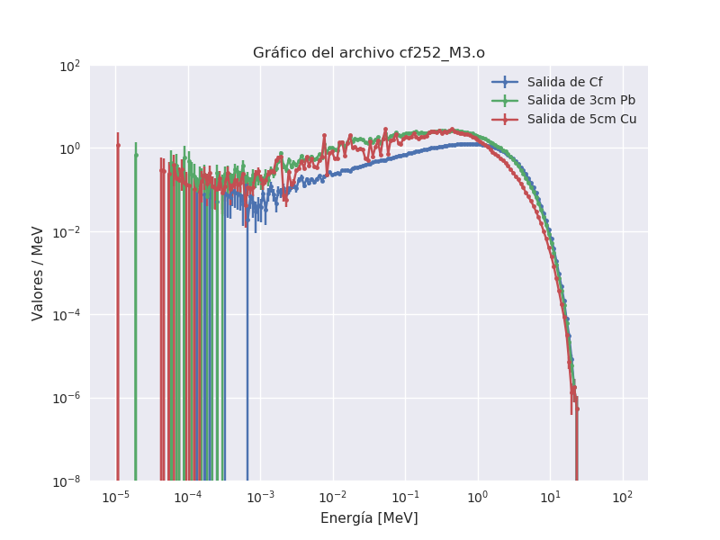
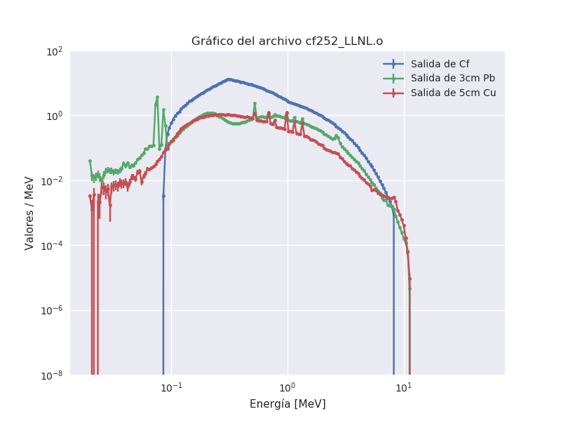
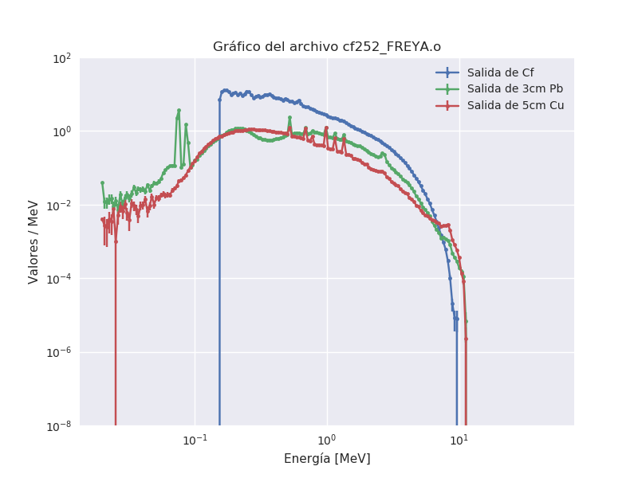
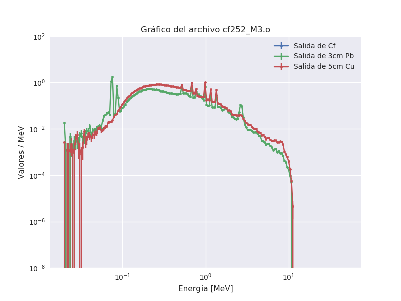

# Simulación de espectros de neutrones y fotones de $^{252}$Cf

Se usan los métodos de FREYA y LLNL para generar los eventos de fisión y las partículas que empiten. No es necesario, en verdad.

El modelo consiste en:

  - Una fuente cuasi puntual de $^{252}$Cf
  - Una cuasi esfera de 3cm de Pb
  - Un cascarón esférico de 5cm de Cu

Se hacen tallies tanto para fotones como para neutrones que cruzan las superficies esféricas que separan a cada material.

## Contenido de la carpeta

  - `cf252_XXXX` : input de MCNP
  - `cd252_XXXX.o` : output de MCNP
  - `espectros_neutrones_XXXX.png` : Gráfico con los espectros de neutrones en cada superficie
  - `espectros_fotones_XXXX.pong` : Gráfico con los espectros de fotones en cada superficie

donde XXXX = {LLNL, FREYA, M3}

Los métodos LLNL y FREYA generan fotones instantáneos a partír de la fisión espontánea del $^{252}Cf$.

El método M3 no genera fotones instantáneos. Utiliza el mismo espectro de neutrones que el LLNL (Watt).

## Resultados

