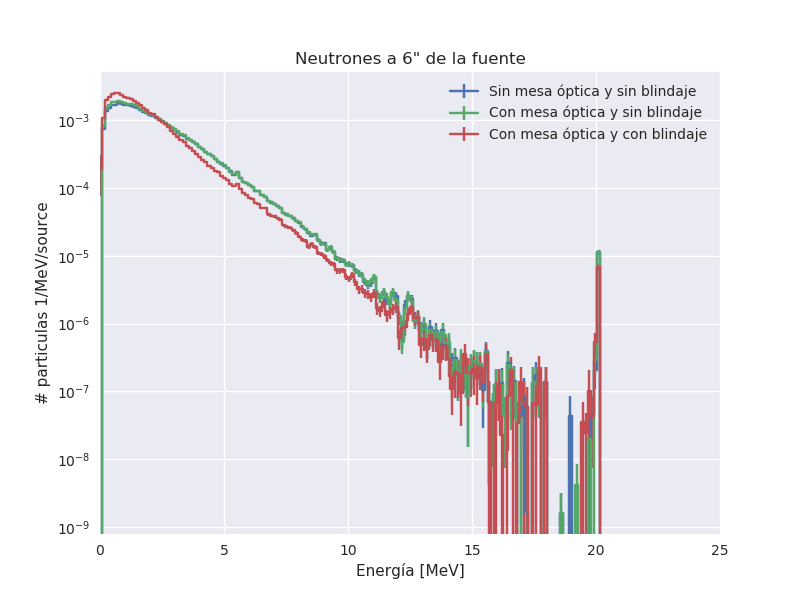
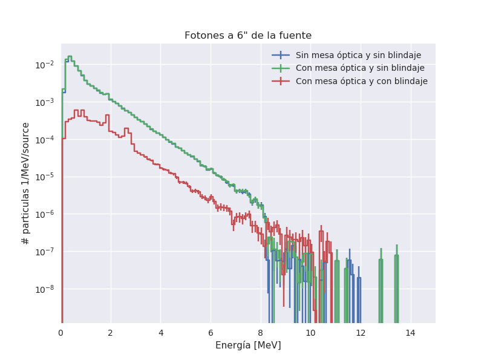

# Simulación del blindaje cinlíndrico para la fuente de Cf252

## Modelo:

1. Fuente de Cf252 emitiendo fotones y neutrones (generador de LLNL)
2. Mesa óptica de acero inoxidable (304L) cilíndrica de 4cm de ancho y 50cm de radio.
3. Blindaje de plomo cilíndrico con:
   * altura = 10" 
   * radio interno = 3"
   * radio externo = 5"
4. Se cuentan neutrones y fotones que pasan a través de una superficie cilíndrica con:
   - radio =6"
   - altura = 10"
   - centrada con la fuente
5. Se simulan tres configuraciones:
   - Sin mesa óptica y sin blindaje (Pb0)
   - Con mesa óptica y sin blindaje (Pb1)
   - Con mesa óptica y con blindaje (Pb2)

## Resultados

