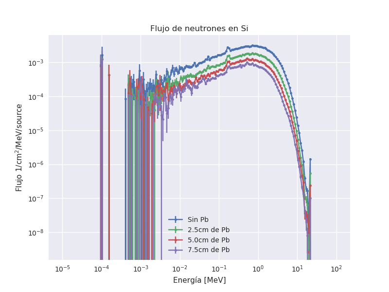
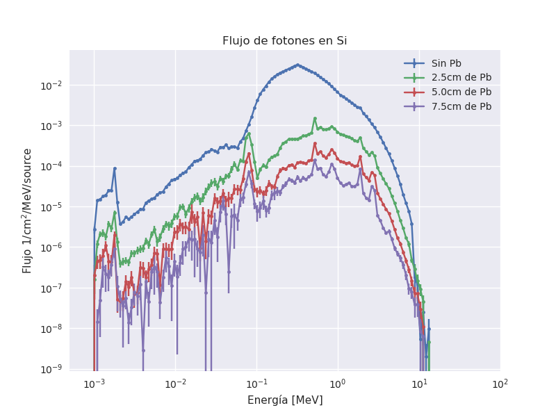
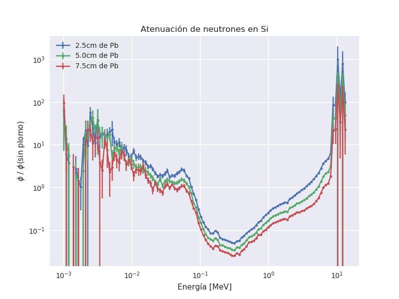
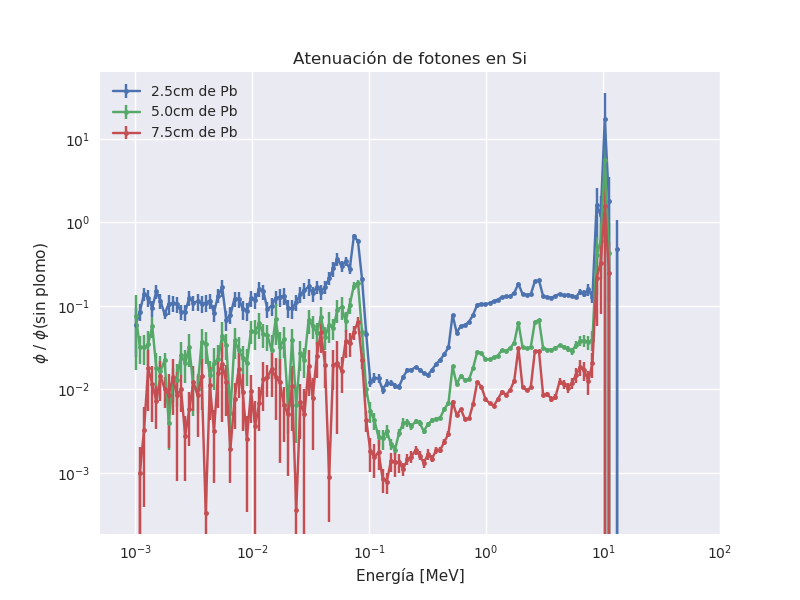

# Simulación del blindaje plano para la fuente de Cf252

## Modelo:

1. Fuente de Cf252 emitiendo fotones y neutrones (generador de LLNL)
3. Blindaje de plomo plano
4. Se simula flujo neutrones y fotones en un bloque de Si
5. Se simulan tres configuraciones:
   - Sin plomo, se usa como normalización (Pb0)
   - 2.5cm de plomo (Pb1)
   - 5.0cm de plomo (Pb2)
   - 7.5cm de plomo (Pb3)
6. El detector siempre se puso a 2.5 cm de donde terminaba el blindaja (o la fuente cuando no lo había). Para tener en cuenta el ángulo sólido del detector.

## Resultados

