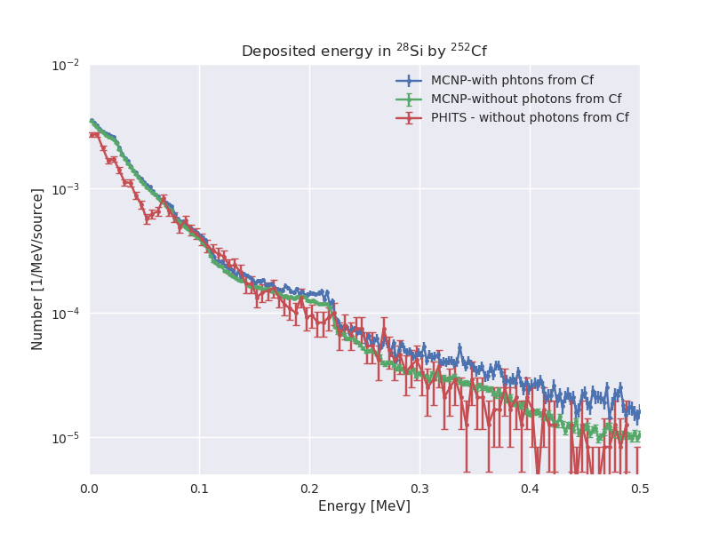

#### Notas:

- La corrida en MCNP se hizo con todos los parámetros nucleare en default (salvo capturas analógicas, pero no influye en este ejemplo).

- La corrida en MCNP es sólo con neutrones y fotones.

- En MCNP no se simularon los fotones del Cf252, pues PHITS no lo simula.

- La coincidencia se logra cuando se activa el generador EGS5 en PHITS para el transporte de fotones, electrones y positrones (negs=1). Por default, sólo transporta fotones (negs=-1).

- Si se activa el generador de eventos para netruones de baja energía (e-mode=2) aparece un pico de neutrones de ~3keV que no está en la simulación de MCNP.

- Cuando se activa negs=1 en PHITS no puede estar el material Cf252 (no existen los datos). Esto no es problema porque (a diferencia de MCNP), PHITS no requiere que exista el material Cf252 para generar una fuente de CF252.

-------------------------------

### Energía depositada en Si 

**En PHITS**:

* Están simuladas todas las partículas y se pide energía depositada total.

**En MCNP**:

* Se simuló sólo neutrones y fotones.

* Se pidió energía depositada por neutrones y fotones.

* En otras pruebas se comprobó que la energía depositada simulada de esta manera es similar a haber simulado núcleos residuales y demás partículas (al menos desde 1keV hasta 1MeV aprox). Más allá de eso habría que correr con todas las partículas.

## Resultados

