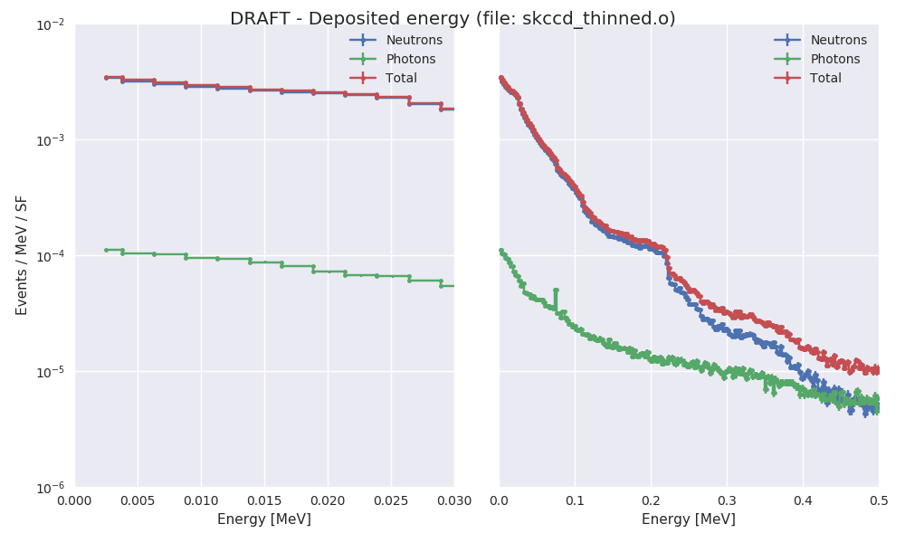
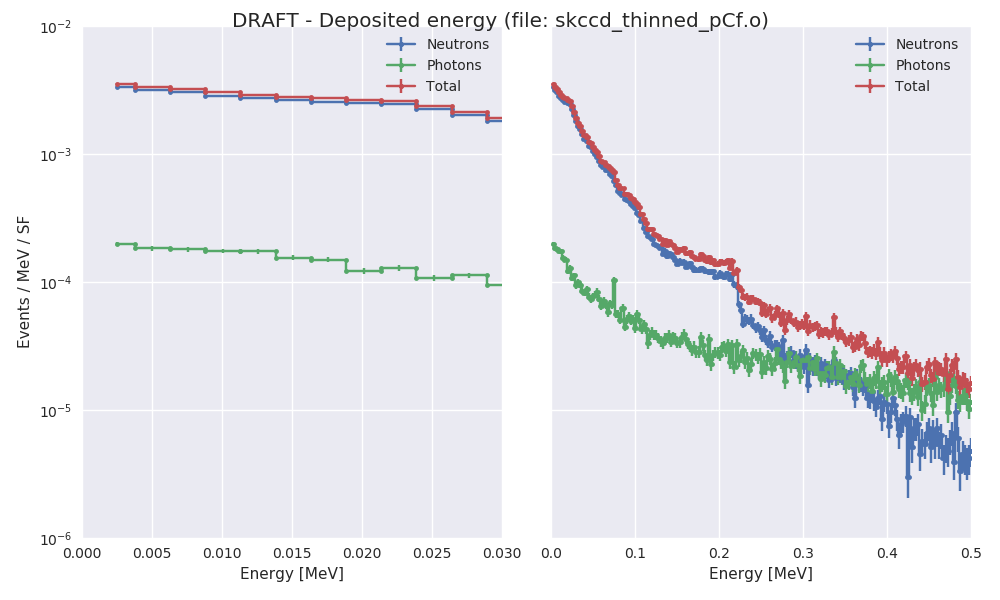
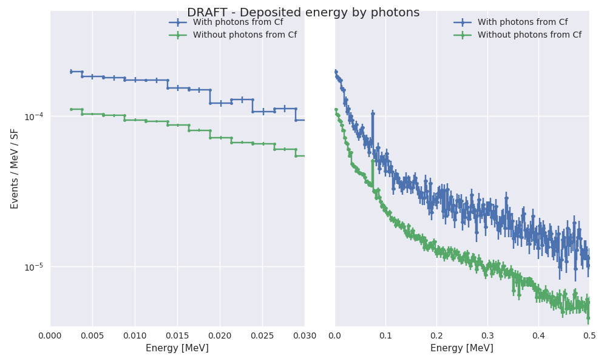

# Simulación del experimento con Skipper CCD delgado

Se simula una fuente de Cf252 que emite neutrons y fotones.

## Contenido:

* `experimeto_mcnp` : input con la geometría para mcnp

* `skccd_thinned` : input con los parámetros de la simulación y las tallies (llama al archivo `experimento_mcnp`. Para calcular flujo y energía depositada

* `run_mcnp.sh` : script auxiliar para correr el input

* `skccd_depo_thinned.o`: salida de la simulación usando sólo neutrones (FMULT=3)

* `skccd_depo_thinned_pCf.o`: salida de la simulación usando neutrones y fotones (FMULT=5)

**Notas**: 

* Se empieza con las talles más básicas (F8) para el espectro de deposición de energía.

* Se corre sólo en modo n p (neutrones y fotones).

* Los fotones provenientes de la fuente resultan despreciables frente a los producidos debido a la interacción con los neutrones.

* El hecho de no usar fotones en la fuente hace que se pueda paralelizaar.

* Se deberá incluir a los electrones para estimar mejor la energía depositada de los fotones.

# Simulación del blindaje cinlíndrico para la fuente de Cf252

## Modelo:

1. Fuente de Cf252 emitiendo fotones y neutrones (generador de LLNL). La fuente está pegada a la pared interna del blindaje de Pb (en la coordenada y).
2. Mesa óptica de acero inoxidable (304L) cilíndrica de 4cm de ancho y 50cm de radio.
3. Blindaje de plomo cilíndrico con:
   * altura = 10" 
   * radio interno = 3"
   * radio externo = 5"
4. Se estima el flujo de neutrones y fotones en un paralelepípedo con Si que simula al detector:
   - largo = 6cm
   - altura = 2cm
   - espesor = 2cm (en verdad tendría que haber puesto 0.02cm)

## Resultados

**Resultado preliminar**:

**Para referencia**:

La única corrda que se hizo con fotones provenientes del Cf252.

Resultados en el archivo `skccd_depo_pCf.o`

