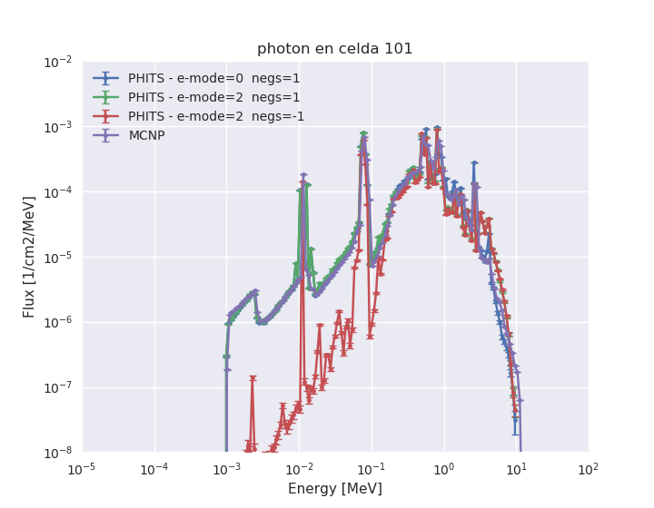
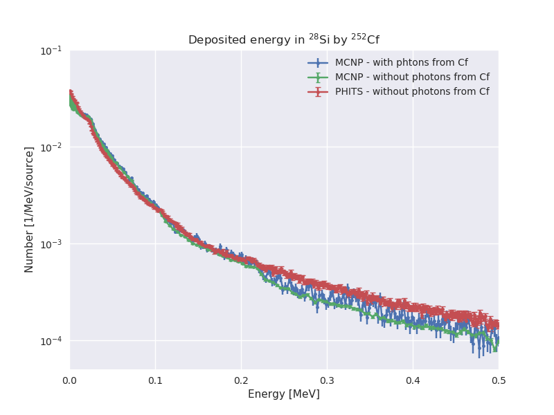

# Simulaciones para un Skipper CCD

se simula el siguiente esquema:

>> Son dos bloques de Cu básicamente de 8 x 12 x 2 pulgadas. Entre ellos se colocó el CCD de Silicio de 9 cm x 3 cm x 675 micrómetros. Abajo de la cámara se colocó Pb de aprox 3 cm de grosor, el ancho y largo cubría en principio toda el área del Cu así que puede considerarse igual. Entre el Pb y la parte de abajo del bloque de Cu calculo una separación de unos 5 cm. La fuente de Cf252 se colocó debajo del Pb

----------------------

## Comparación entre MCNP y PHITS

### Flujo de partículas en el Pb (celda 101)

#### Notas:

- La corrida en MCNP se hizo con todos los parámetros nucleare en default (salvo capturas analógicas, pero no influye en este ejemplo).

- La corrida en MCNP es sólo con neutrones y fotones.

- En MCNP no se simularon los fotones del Cf252, pues PHITS no lo simula.

- La coincidencia se logra cuando se activa el generador EGS5 en PHITS para el transporte de fotones, electrones y positrones (negs=1). Por default, sólo transporta fotones (negs=-1).

- Si se activa el generador de eventos para netruones de baja energía (e-mode=2) aparece un pico de neutrones de ~3keV que no está en la simulación de MCNP.

- Cuando se activa negs=1 en PHITS no puede estar el material Cf252 (no existen los datos). Esto no es problema porque (a diferencia de MCNP), PHITS no requiere que exista el material Cf252 para generar una fuente de CF252.

-------------------------------

### Energía depositada en Si 

**En PHITS**:

* Están simuladas todas las partículas y se pide energía depositada total.

**En MCNP**:

* Se simuló sólo neutrones y fotones.

* Se pidió energía depositada por neutrones y fotones.

* En otras pruebas se comprobó que la energía depositada simulada de esta manera es similar a haber simulado núcleos residuales y demás partículas (al menos desde 1keV hasta 1MeV aprox). Más allá de eso habría que correr con todas las partículas.

#### Notas:

* No se simularon los fotones de la fuente de californio. El aporte no es significativo (con este blindaje) frente a los fotones que se generan en el resto de los materiales.

* Incluir los fotones de la fuente implica:
    - MCNP no se puede paralelizar
    - En PHITS el espectro de fotones del Cf debe incluirse por separado

### TODO:

- Revisar el bineado entre PHITS y MCNP, los datos parecen estar desplazados en un bin de energía.

- Analizar por qué aparece el pico de neutrones a baja energía con e-mode=2 en PHITS.

- Mejorar la estadística.

- Agregar la emisión de fotones en la fuente de Cf252 en PHITS. A mano.

