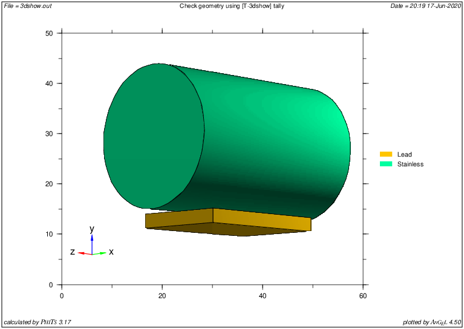
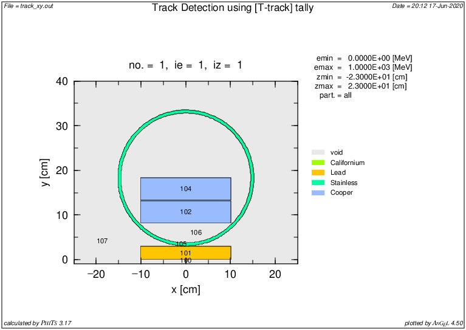
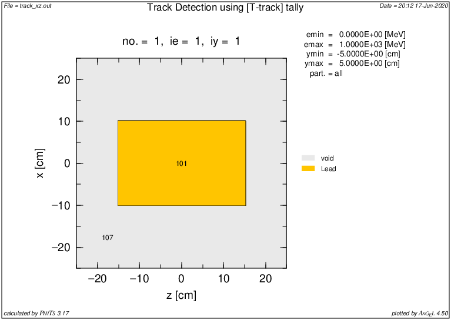
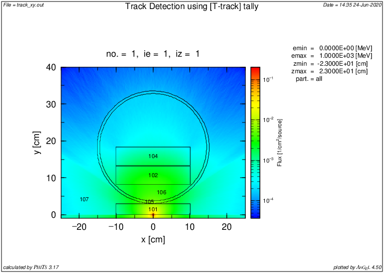
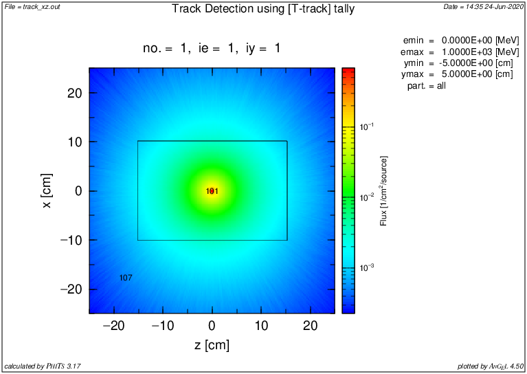
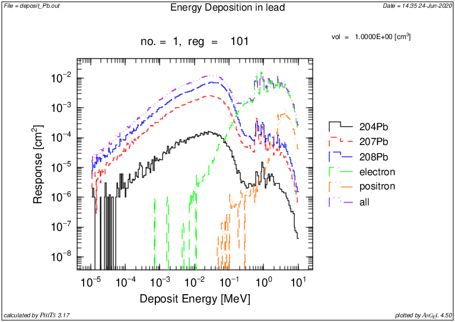
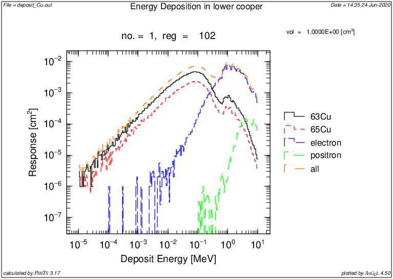
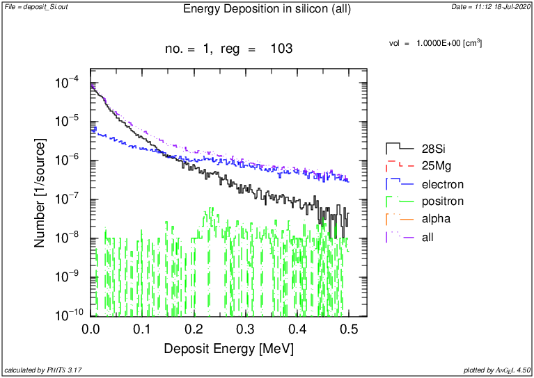

# Simulación experimento Skipper CCD con PHITS

**No se simulan los fotones de la fuente de Cf252**

## Contenido:

* `experimeto_phits` : input con la geometría para phits

* `skccd_phits.inp` : input con los parámetros de la simulación y las tallies (llama al archivo `experimento_phits`

* `run_phits.sh` : script auxiliar para correr el input y transfromar imágenes

E## Geometría simulada

### Resultados de prueba

## Notas

- Cuando se piden tallies por regiones, se debe poner el volúmen a mano. Existe la forma de que lo calcule, pero al tener geometrías de tamaños muy distintos (el Si sobre todo) es bastante ineficiente. Puse los valores calculados a mano (que son exactamente los que calcula MCNP).

## Deposición de energía

Pruebas para entender cómo se calcula en PHITS

Tres tallies distintas: para plomo, cobre inferior y silicio.

Notas:

- Para entender la deposición total de energía en cada material hay que buscar lo nucleídos que podrían dejar energía (no se sabe a priori y no lo dice tampoco).

- Con las pruebas hasta ahora (1e6 partículas), en ningún caso hubo deposición de energía de fotones.

- Tiempo de ejecución (95 +1 cores) para $10^9$ fisiones espontáneas : 2.36hs (wall time)

### Resultados:

#
