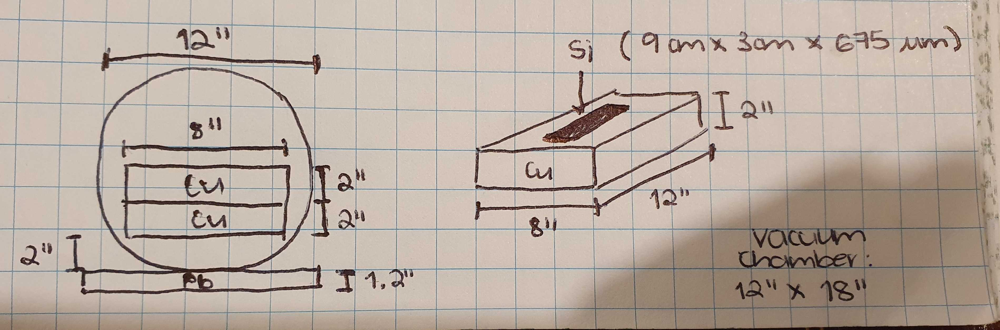

# Simulaciones para un Skipper CCD

se simula el siguiente esquema:

>> Son dos bloques de Cu básicamente de 8 x 12 x 2 pulgadas. Entre ellos se colocó el CCD de Silicio de 9 cm x 3 cm x 675 micrómetros. Abajo de la cámara se colocó Pb de aprox 3 cm de grosor, el ancho y largo cubría en principio toda el área del Cu así que puede considerarse igual. Entre el Pb y la parte de abajo del bloque de Cu calculo una separación de unos 5 cm. La fuente de Cf252 se colocó debajo del Pb
