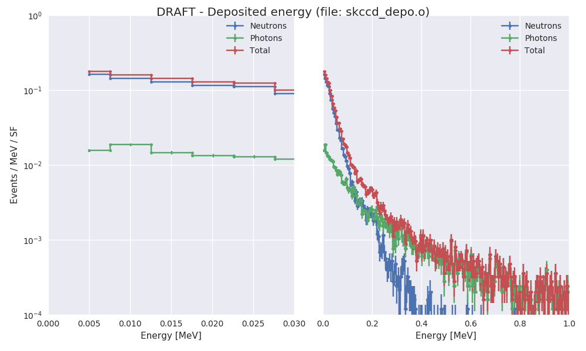

# Simulación experimento Skipper CCD con MCNP

Se simula una fuente de Cf252 que emite neutrons y fotones.

## Contenido:

* `experimeto_mcnp` : input con la geometría para mcnp

* `skccd` : input con los parámetros de la simulación y las tallies (llama al archivo `experimento_mcnp`. Para calcular flujo

* `skccd_depo` : input con los parámetros de la simulación y las tallies (llama al archivo `experimento_mcnp`. Para calcular flujo y energía depositada

* `run_mcnp.sh` : script auxiliar para correr el input

**Notas**: 

* Se empieza con las talles más básicas (F8) para el espectro de deposición de energía.

* Se corre sólo en modo n p (neutrones y fotones).

* Los fotones provenientes de la fuente resultan despreciables frente a los producidos debido a la interacción con los neutrones.

* El hecho de no usar fotones en la fuente hace que se pueda paralelizaar.

* Se deberá incluir a los electrones para estimar mejor la energía depositada de los fotones.

## Resultados

**Resultado preliminar**:

**Para referencia**:

La única corrda que se hizo con fotones provenientes del Cf252.

Resultados en el archivo `skccd_depo_pCf.o`

