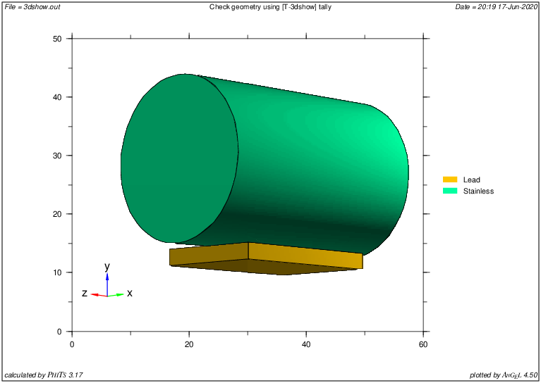
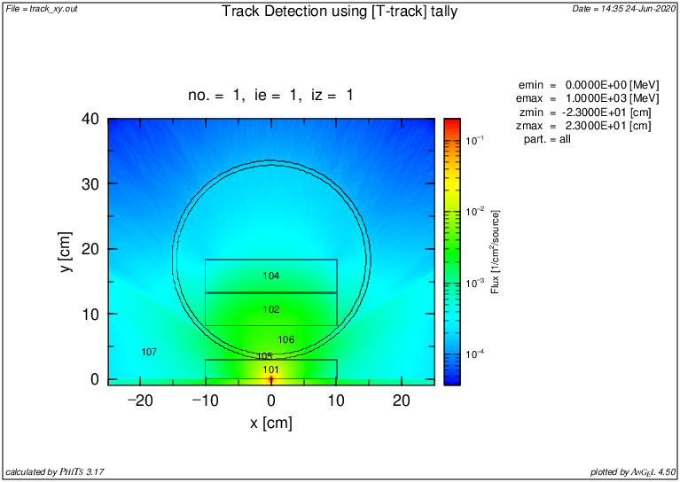
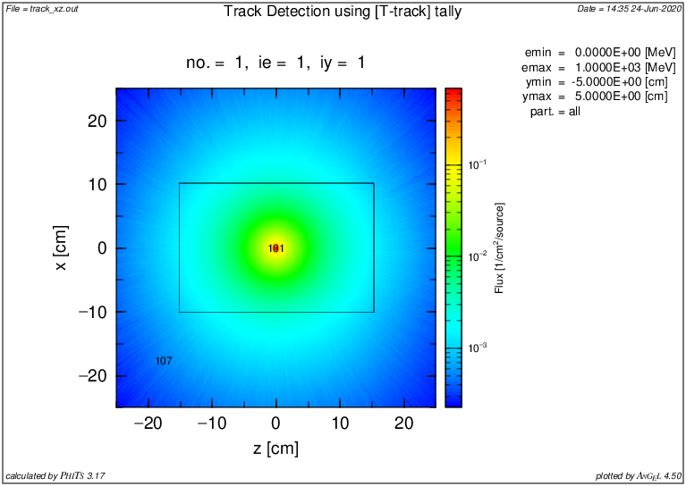

# Simulación experimento Skipper CCD con PHITS

**No se simulan los fotones de la fuente de Cf252**

## Contenido:

* `experimeto_phits` : input con la geometría para phits

* `skccd_phits.inp` : input con los parámetros de la simulación y las tallies (llama al archivo `experimento_phits`

* `run_phits.sh` : script auxiliar para correr el input y transfromar imágenes

## Geometría simulada

## Resultados de prueba

## Notas

- Cuando se piden tallies por regiones, se debe poner el volúmen a mano. Existe la forma de que lo calcule, pero al tener geometrías de tamaños muy distintos (el Si sobre todo) es bastante ineficiente. Puse los valores calculados a mano (que son exactamente los que calcula MCNP).
