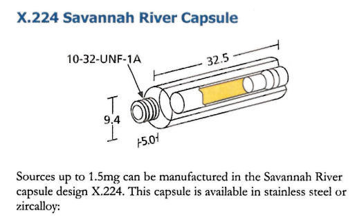
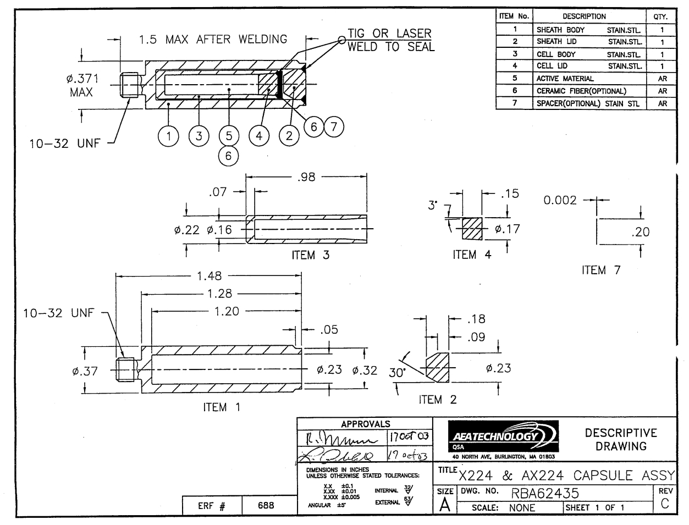

# Simulación detallada de la fuente de Cf252

**Objetivo**: simular con mayor detalle cómo son los espectros de neutrones y de fotones que se emiten de la fuente de Cf252. Analizar si es necesario modelar el encapsulado, contenedor y todos los materiales para reproducir los datos del experimento.

# Modelo

- La fuente utilizada es el modelo X.224 de la marca AEATECHNOLOGY

- Posee un doble encapsulado de acero inoxidable

- A su vez, la fuente estaba ubicada en un contenedor de acero inoxidable para facilitar su manipulación

- Se tiene información detallada de la geometría tanto de la fuente como del contenedor

- No se encontró demasiada información sobre la composición del material activo de este modelo de fuente.

## Materiales utilizados

- Tanto el encapsulado como el contenedor se los asumió de acero inoxidable 304L

- En el catálogo de la empresa no se especifical a composición del material activo. Sólo se dice, de forma general, que:

> Californium-252 is in the form of a cermet of californium oxide and palladium metal,
> or as a refractory composite material. Low activity sources (<1$\mu$g) may contain a Cf-252
> compound deposited or ion-exchanged onto a substrate within the capsule.

- Se encontró que fuentes de Cf252 fabricadas en el laboratorio "Savannah River" estaban compuestas por un cermet (compuesto cerámico-metálico) de Pd-Cf$_2$O$_3$ con las siguientes propociones:

  - 99.9% de Pd 
  -  0.1% de Cf$_2$O$_3$

- La composición isotópica (en peso) del californio es:

  -  2% 249Cf
  - 15% 250Cf
  -  4% 251Cf
  - 79% 252Cf

- Siendo que el californio sólo se produce en dos reactores en el mundo (ORNL y Rusia) es muy probable que esta composición isotópica sea la misma. Respecto al porcentaje entre óxido y paladio, el modelo de la cápsula utilizada se llama "Savannah River" por lo que se tiene altas chances que sea la composición de la fuente X224

- Como no se encontró la densidad del cermet de Pd-Cf2O3, se utilizó la densidad del paladio (ya que este es el 99.9%).

## Imágenes y planos de la fuente

  

## Referencias

- Mosley et al. *Californium oxide - palladium cermet wire as a 252Cf neutron source form*. Savannah River Laboratory, january 1974.

