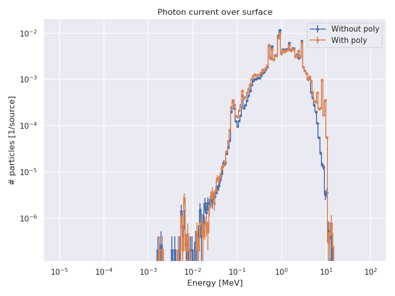

# Simulación para la propuesta de medición del quenching factor

## Modelo

- Fuente cuasi puntual de Cf252 emitiendo en 4$\pi$. Emite neutrones y fotones con el generador FEYA.

- Geometría cilíndrica con las siguientes capas:

    1. Cilindro de acero inox con 0.2 cm espesor (radio ext 5cm)

    2. Cilindro de poly/vacio de 0.5 cm de espesor (radio ext 7.5cm). Hago dos corridas, en una lo dejo vacío y en otra con poly

    3. Cilindro de plomo de 2.5 cm de espesor (radio externo 20cm)

- Altura de todo el sistema 20 cm

- El detector por ahora está de vista

- Detector y fuente centrados a 10 cm en eje axial

tallies, por ahora, miden corriente de partículas en las siguientes superficies:

- Superficie de la fuente

- Superficie interna del poly/vacio

- Superficie interna del cilindro de acero. Asumo que esto es lo que llegará al detector

Aclaro que el tally de corriente mide partículas que atraviesan la superficie, sin importar dirección. Es decir, yo estaría midiendo también neutrones/fotones que atraviesan todo el sistema y siguen de largo. Más adelante mi idea es cuantificar esto ¿conviene trabajar con cilindros o medio cilindros? (para evitar partículas que le reboten por atrás al detector).

## Resultados

### Espectros de partículas a través de las tres superficies antes mencionadas

### Diferencias entre poner poly y no ponerlo

Están medidas en la superficie interna del acero
 

       

