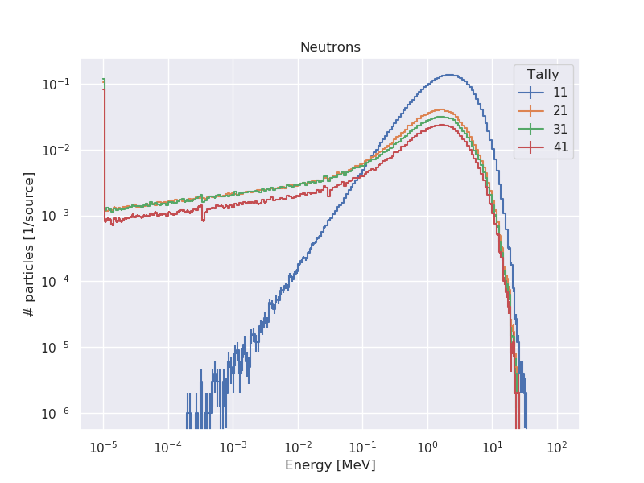
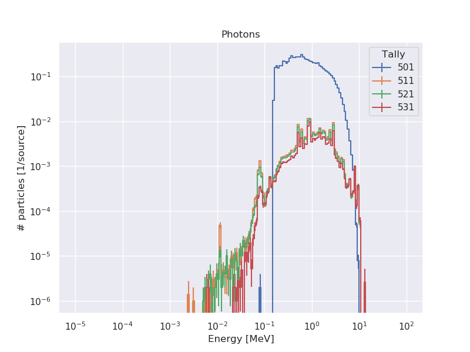
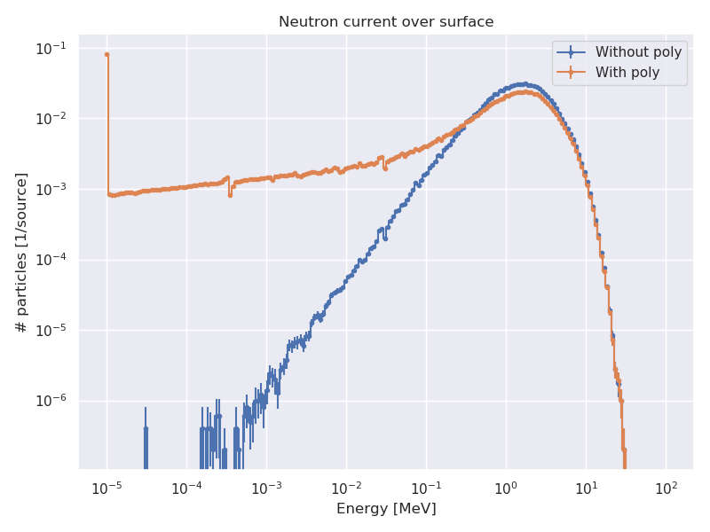

# Simulación para la propuesta de medición del quenching factor

## Modelo

- Fuente cuasi puntual de Cf252 emitiendo en 4$\pi$. Emite neutrones y fotones con el generador FEYA.

- Geometría cilíndrica con las siguientes capas:

    1. Cilindro de acero inox con 0.1651 cm espesor (radio ext 5.08cm)

    2. Cilindro de poly/vacio de 1.0 cm de espesor (radio ext 7.7cm). Hago dos corridas, en una lo dejo vacío y en otra con poly

    3. Cilindro de plomo de 4.7 cm de espesor (radio externo 12.4cm)

- Altura de todo el sistema 29.2 cm

- El detector por ahora está de vista

- Detector y fuente centrados a 12.41 cm en eje axial

Las tallies que miden corriente de partículas se tomaron en las siguientes superficies:

- Superficie de la fuente

- Superficie interior del plomo

- Superficie interna del poly/vacio

- Superficie interna del cilindro de acero. Asumo que esto es lo que llegará al detector

Aclaro que el tally de corriente mide partículas que atraviesan la superficie, sin importar dirección. Es decir, yo estaría midiendo también neutrones/fotones que atraviesan todo el sistema y siguen de largo. Más adelante mi idea es cuantificar esto ¿conviene trabajar con cilindros o medio cilindros? (para evitar partículas que le reboten por atrás al detector).

Se agregó tally para medi flujo de partículas:

- En celda del detector

## Resultados

### Espectros de partículas a través de las cuatro superficies antes mencionadas

### Diferencias entre poner poly y no ponerlo

Medidas en la superficie interna del acero
 

       
Medidas de flujo en detector

### Efecto de los fotones de fuente

Se compara el flujo de fotones sobre el detector:

* Fuente emitiendo neutrones y fotones
* Fuente emitiendo sólo neutrones

En MCNP lo modelo usando la tarjeta FMULT=3 que usa un generador de eventos que sólo produce neutrones del Cf252, en comparación con el FMULT=6 que produce neutrones y fotones.

En esta comparación no hay poly:

