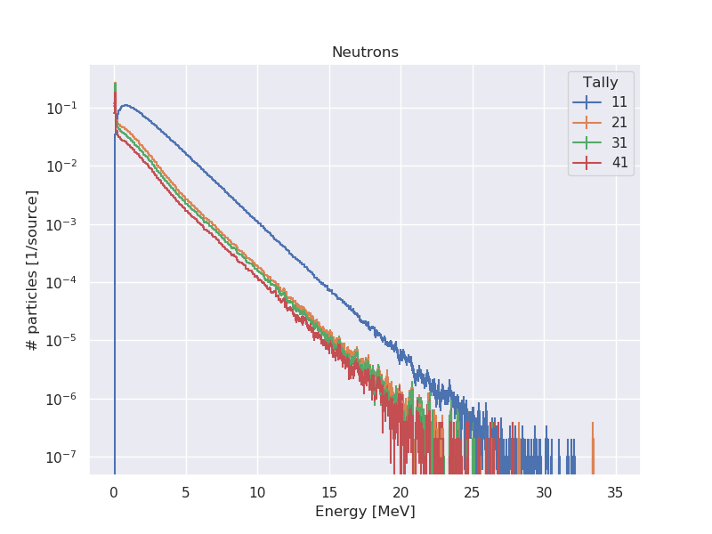
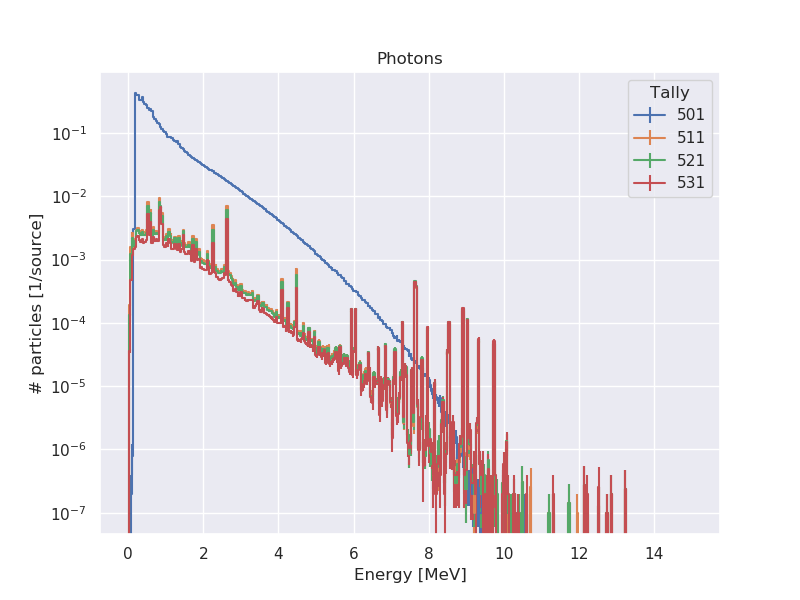
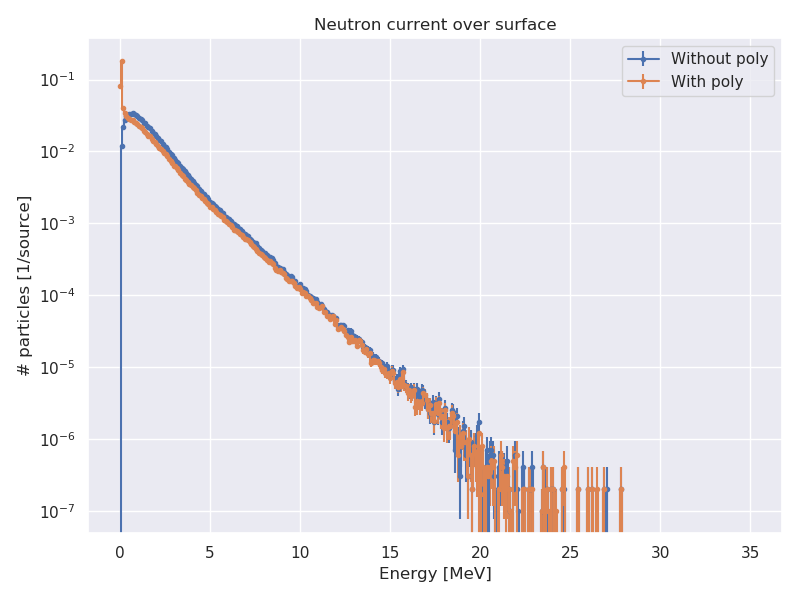
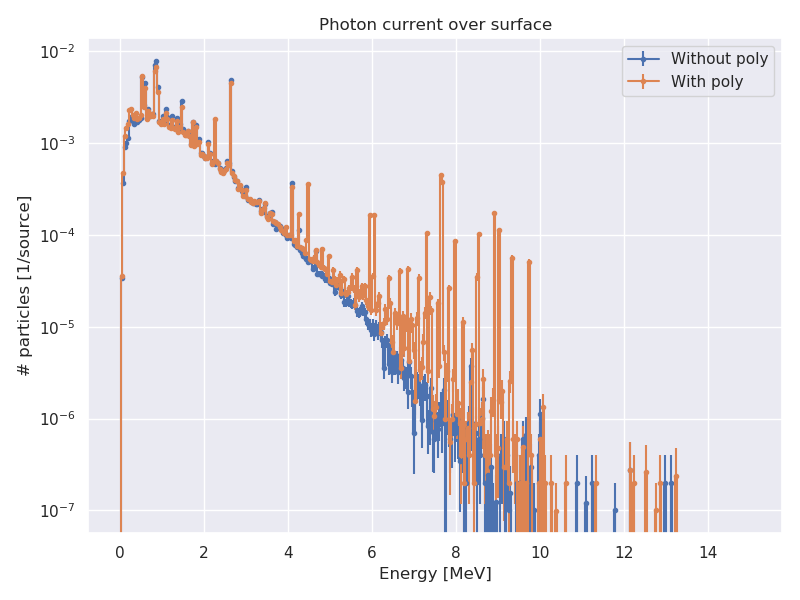
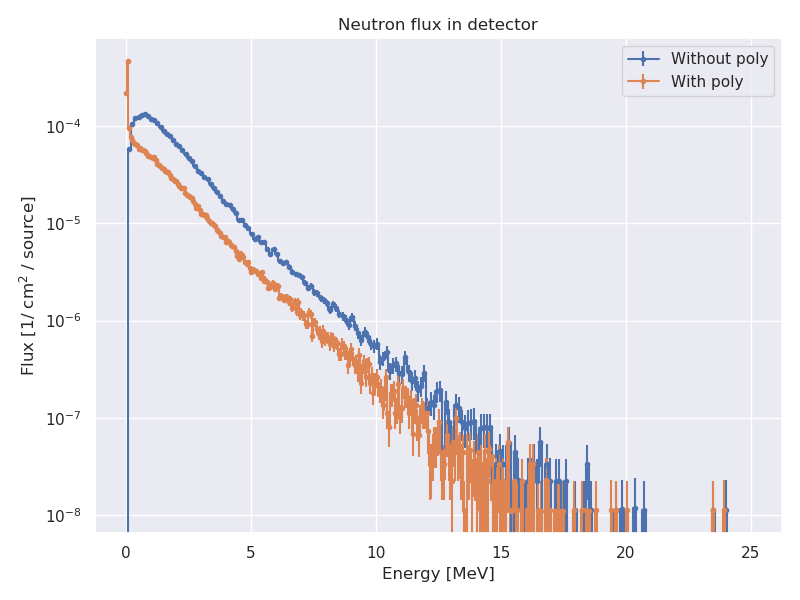

# Simulación para la propuesta de medición del quenching factor

Es lo mismo que en la carpeta de arriba, pero con los tallies en escala lineal

## Resultados

### Espectros de partículas a través de las cuatro superficies antes mencionadas

### Diferencias entre poner poly y no ponerlo

Medidas en la superficie interna del acero
 

       
Medidas de flujo en detector

