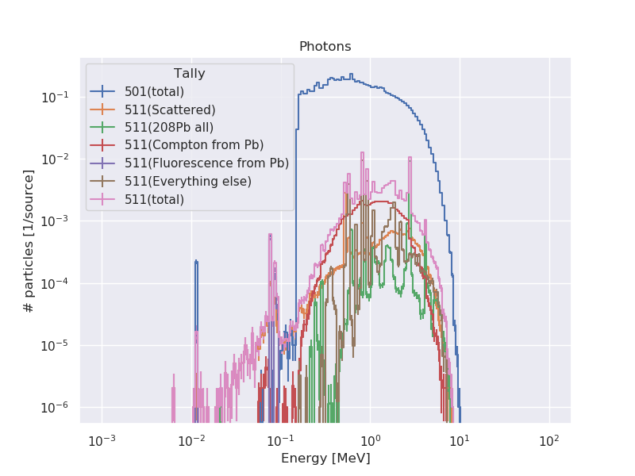
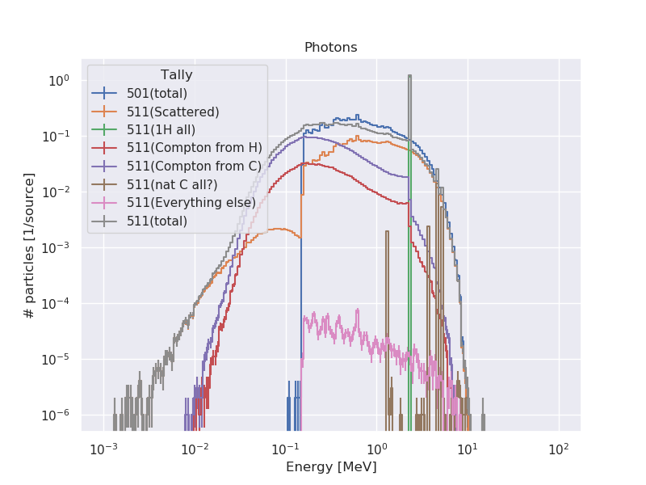
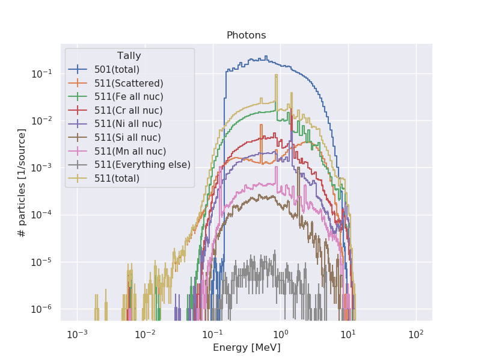

# Simulación para analizar cómo utilizar tag en MCNP

Se pretende identificar la contribución a los tallies (principalmente de fotones)
de los elementos y reacciones de mayor importania

## Modelo

Fuente puntual de Cf252 rodeada por material. 

La fuente emite neutrnoes y fotones.

Se mide corriente saliente del sistema

## Resultados

# Con plomo

# Con poly

# Con acero

